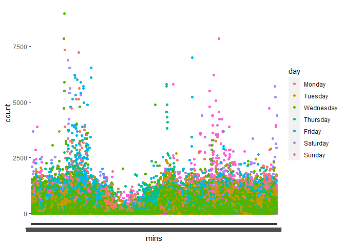
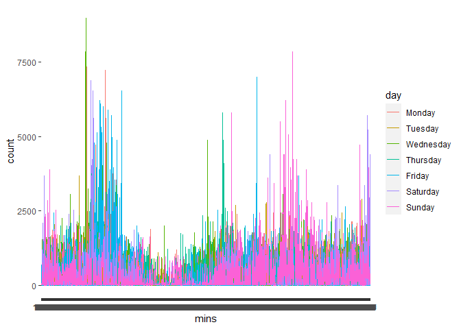
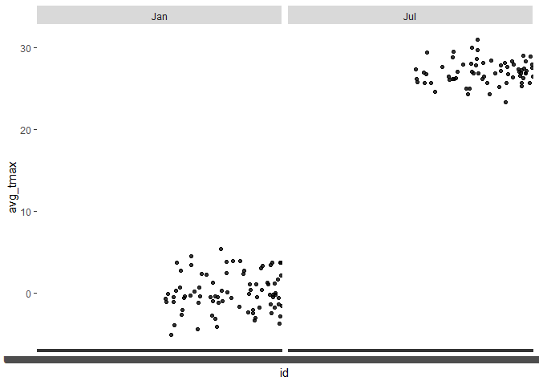

p8105_hw_3\_hg2596
================
2022-10-15

``` r
library(tidyverse)
```

    ## ── Attaching packages ─────────────────────────────────────── tidyverse 1.3.2 ──
    ## ✔ ggplot2 3.3.6      ✔ purrr   0.3.4 
    ## ✔ tibble  3.1.8      ✔ dplyr   1.0.10
    ## ✔ tidyr   1.2.0      ✔ stringr 1.4.1 
    ## ✔ readr   2.1.2      ✔ forcats 0.5.2 
    ## ── Conflicts ────────────────────────────────────────── tidyverse_conflicts() ──
    ## ✖ dplyr::filter() masks stats::filter()
    ## ✖ dplyr::lag()    masks stats::lag()

``` r
library(p8105.datasets)
```

# Problem 2

``` r
accel_1 = read_csv("./data/accel_data.csv")%>%
  janitor::clean_names() 
```

    ## Rows: 35 Columns: 1443
    ## ── Column specification ────────────────────────────────────────────────────────
    ## Delimiter: ","
    ## chr    (1): day
    ## dbl (1442): week, day_id, activity.1, activity.2, activity.3, activity.4, ac...
    ## 
    ## ℹ Use `spec()` to retrieve the full column specification for this data.
    ## ℹ Specify the column types or set `show_col_types = FALSE` to quiet this message.

``` r
accel_2 =  pivot_longer(
    accel_1, 
    activity_1:activity_1440,
    names_to = "mins",  
    names_prefix = "activity_",
    values_to = "count"
    ) %>%
  mutate(Week_identify = ifelse(day%in%c("Saturday", "Sunday"), 2, 1)) %>%
  mutate(day = fct_relevel(day,"Monday","Tuesday","Wednesday", "Thursday", "Friday","Saturday", "Sunday"))
```

Originally had over 1440 columns, the following variables were: **week**
(1-5),**day_ID** (just a count), **day** (Mon-Sun), **activity_1**,
**activity_2**…activity count following the patient 24 hours.

Now, after pivoting longer, we are able to put the counts is **counts**
making it one variable,and made a new variable **mins** to kep track
which count came from which minute of the week.

There are now 50400 observations and 6 wows

``` r
accel_3 = 
accel_2 %>%
  mutate(day = as.factor(day))%>%
  group_by(week,day) %>%
  summarize(total_activity = sum(count))
```

    ## `summarise()` has grouped output by 'week'. You can override using the
    ## `.groups` argument.

maybe ad false = true so the high can come to the beginning

``` r
accel_4 = accel_3 %>%
  pivot_wider(
  names_from = "day", 
  values_from = "total_activity")
```

**Question 1; Part 2** Any trends apparent?

A big drop on the weekends.

``` r
ggplot(accel_2, aes(x = mins, y = count, color = day)) + 
  geom_point()
```

<!-- -->

``` r
ggplot(accel_2, aes(x = mins, y = count, color = day)) + 
  geom_line()
```

<!-- -->

**Question 1; Part 3**

Describe any patterns or conclusions - Most stay under 2500, two big
peaks toward the beginning of the day and end. - Which one is better
representative, the line or the point?

# Problem 3

``` r
data("ny_noaa")
```

``` r
names(ny_noaa)
```

    ## [1] "id"   "date" "prcp" "snow" "snwd" "tmax" "tmin"

``` r
head(ny_noaa)
```

    ## # A tibble: 6 × 7
    ##   id          date        prcp  snow  snwd tmax  tmin 
    ##   <chr>       <date>     <int> <int> <int> <chr> <chr>
    ## 1 US1NYAB0001 2007-11-01    NA    NA    NA <NA>  <NA> 
    ## 2 US1NYAB0001 2007-11-02    NA    NA    NA <NA>  <NA> 
    ## 3 US1NYAB0001 2007-11-03    NA    NA    NA <NA>  <NA> 
    ## 4 US1NYAB0001 2007-11-04    NA    NA    NA <NA>  <NA> 
    ## 5 US1NYAB0001 2007-11-05    NA    NA    NA <NA>  <NA> 
    ## 6 US1NYAB0001 2007-11-06    NA    NA    NA <NA>  <NA>

``` r
noaa_2 = ny_noaa %>% 
  janitor::clean_names() %>%
  separate(date,c("A", "B", "C")) %>%
  select("B","C","A", everything()) %>%
  rename(month = "B", day = "C", year = "A") %>%
  mutate(month = month.abb[as.numeric(month)]) %>%
  mutate(tmax = as.integer(tmax)) %>%
  mutate(tmin = as.integer(tmin)) %>%
  select(id, everything()) 

head(noaa_2)
```

    ## # A tibble: 6 × 9
    ##   id          month day   year   prcp  snow  snwd  tmax  tmin
    ##   <chr>       <chr> <chr> <chr> <int> <int> <int> <int> <int>
    ## 1 US1NYAB0001 Nov   01    2007     NA    NA    NA    NA    NA
    ## 2 US1NYAB0001 Nov   02    2007     NA    NA    NA    NA    NA
    ## 3 US1NYAB0001 Nov   03    2007     NA    NA    NA    NA    NA
    ## 4 US1NYAB0001 Nov   04    2007     NA    NA    NA    NA    NA
    ## 5 US1NYAB0001 Nov   05    2007     NA    NA    NA    NA    NA
    ## 6 US1NYAB0001 Nov   06    2007     NA    NA    NA    NA    NA

``` r
noaa_3= 
  noaa_2 %>% 
  mutate(tmax_new = tmax/10) %>%
  mutate(tmin_new = tmin/10) %>%
  mutate(prcp_1 = prcp/10) %>% 
  mutate(prcp_new = prcp_1/1000) %>% 
  mutate(snow_new = snow/1000) %>%
  mutate(snwd_new = snwd/1000) %>% 
  mutate_if(is.double,as.integer)
```

tmax: Maximum temperature (tenths of degrees C) -\> C tmin: Minimum
temperature (tenths of degrees C) -\> C

prcp: Precipitation (tenths of mm) -\> m snow: Snowfall (mm) -\> m snwd:
Snow depth (mm) -\> m

``` r
noaa_3 %>% 
  count(snow_new, name = "n_obs", sort = TRUE)
```

    ## # A tibble: 6 × 2
    ##   snow_new   n_obs
    ##      <int>   <int>
    ## 1        0 2213946
    ## 2       NA  381221
    ## 3        1       5
    ## 4        7       2
    ## 5        6       1
    ## 6       10       1

\*\* Question 3;

The goal is to do some exploration of this dataset. To that end, write a
short description of the dataset, noting the size and structure of the
data, describing some key variables, and indicating the extent to which
missing data is an issue. Then, do or answer the following (commenting
on the results of each):

After cleaning, **ID**, **date** (month,day,year), **prcp**, **snow**,
**snwd**, **tmax** and **tmin**.

**missing** alot…?

For snowfall, what are the most commonly observed values? Why?

Most common is no snow days, “0”. The reason behind that can be because
location, not too many snow days.

``` r
noaa_3 %>%
  mutate(tmax_new = as.numeric(tmax_new)) %>%
  group_by(id, month) %>%
  filter(month == "Jan"| month == "Jul") %>%
  summarize(avg_tmax = mean(tmax_new)) %>%
  ggplot(aes(x = id, y = avg_tmax)) + geom_point(alpha = .8) + facet_grid(. ~ month)
```

    ## `summarise()` has grouped output by 'id'. You can override using the `.groups`
    ## argument.

    ## Warning: Removed 1186 rows containing missing values (geom_point).

<!-- -->

Is there any observational, interpretable structure. Any outliers? try
box plot?

``` r
skimr::skim(noaa_3)
```

|                                                  |         |
|:-------------------------------------------------|:--------|
| Name                                             | noaa_3  |
| Number of rows                                   | 2595176 |
| Number of columns                                | 15      |
| \_\_\_\_\_\_\_\_\_\_\_\_\_\_\_\_\_\_\_\_\_\_\_   |         |
| Column type frequency:                           |         |
| character                                        | 4       |
| numeric                                          | 11      |
| \_\_\_\_\_\_\_\_\_\_\_\_\_\_\_\_\_\_\_\_\_\_\_\_ |         |
| Group variables                                  | None    |

Data summary

**Variable type: character**

| skim_variable | n_missing | complete_rate | min | max | empty | n_unique | whitespace |
|:--------------|----------:|--------------:|----:|----:|------:|---------:|-----------:|
| id            |         0 |             1 |  11 |  11 |     0 |      747 |          0 |
| month         |         0 |             1 |   3 |   3 |     0 |       12 |          0 |
| day           |         0 |             1 |   2 |   2 |     0 |       31 |          0 |
| year          |         0 |             1 |   4 |   4 |     0 |       30 |          0 |

**Variable type: numeric**

| skim_variable | n_missing | complete_rate |   mean |     sd |   p0 | p25 | p50 | p75 |  p100 | hist  |
|:--------------|----------:|--------------:|-------:|-------:|-----:|----:|----:|----:|------:|:------|
| prcp          |    145838 |          0.94 |  29.82 |  78.18 |    0 |   0 |   0 |  23 | 22860 | ▇▁▁▁▁ |
| snow          |    381221 |          0.85 |   4.99 |  27.22 |  -13 |   0 |   0 |   0 | 10160 | ▇▁▁▁▁ |
| snwd          |    591786 |          0.77 |  37.31 | 113.54 |    0 |   0 |   0 |   0 |  9195 | ▇▁▁▁▁ |
| tmax          |   1134358 |          0.56 | 139.80 | 111.42 | -389 |  50 | 150 | 233 |   600 | ▁▂▇▆▁ |
| tmin          |   1134420 |          0.56 |  30.29 | 104.00 | -594 | -39 |  33 | 111 |   600 | ▁▁▇▂▁ |
| tmax_new      |   1134358 |          0.56 |  13.64 |  10.97 |  -38 |   5 |  15 |  23 |    60 | ▁▃▇▆▁ |
| tmin_new      |   1134420 |          0.56 |   2.92 |  10.06 |  -59 |  -3 |   3 |  11 |    60 | ▁▁▇▂▁ |
| prcp_1        |    145838 |          0.94 |   2.81 |   7.72 |    0 |   0 |   0 |   2 |  2286 | ▇▁▁▁▁ |
| prcp_new      |    145838 |          0.94 |   0.00 |   0.00 |    0 |   0 |   0 |   0 |     2 | ▇▁▁▁▁ |
| snow_new      |    381221 |          0.85 |   0.00 |   0.01 |    0 |   0 |   0 |   0 |    10 | ▇▁▁▁▁ |
| snwd_new      |    591786 |          0.77 |   0.00 |   0.03 |    0 |   0 |   0 |   0 |     9 | ▇▁▁▁▁ |

``` r
graph = 
  noaa_3 %>% 
  mutate(year = as.factor(year)) %>%
  ggplot(aes(x = tmax_new, y = tmin_new)) + 
  geom_hex()
```

``` r
scatter = 
  noaa_3 %>%
  filter(snow_new > 0) %>%
  filter(snow_new < 100) %>%
  ggplot(aes(x = snow_new , y = year)) + geom_line()
```

no question asked.

helpful with axis:

``` r
#theme(axis.text.x = element_blank(), legend.position = "none")
```

scatter_snow = noaa_3 %\>% mutate(year = as.factor(year)) %\>%
filter(snow_new \> 0) %\>% filter(snow_new \<100) %\>% ggplot(aes(x =
snow_new, y = year)) + geom_line() + theme(legend.position = “none”)

(hex_temp/scatter_snow)
